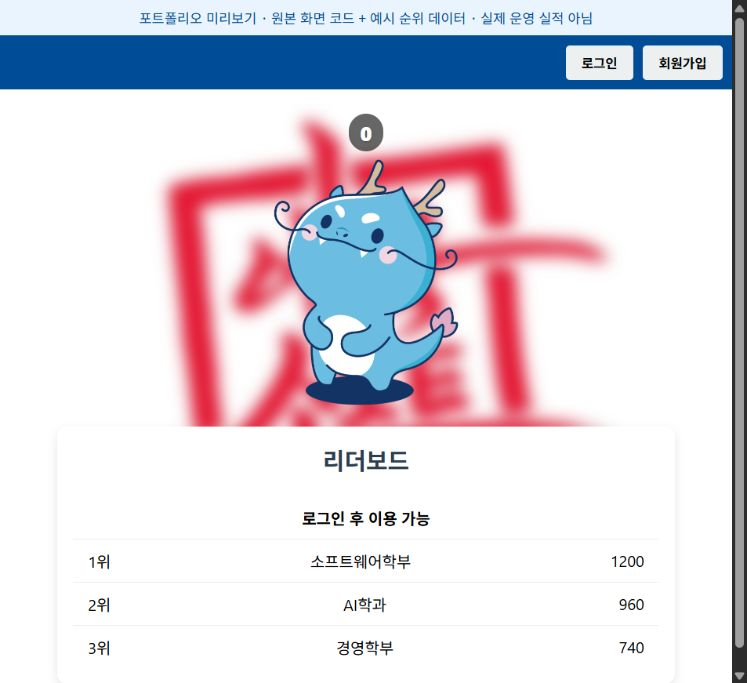

# PopPuang · 팝푸앙

**푸앙이를 클릭하며 학과별 점수를 쌓고 순위를 확인하는 웹 서비스입니다.**



<sub>저장소의 실제 HTML·이미지를 바탕으로 만든 정적 미리보기입니다. 화면 간격은 소개용으로 조정했고, 순위·클릭 수는 예시 데이터입니다. 운영 서비스나 DB 연결을 캡처한 화면은 아닙니다.</sub>

## 첫 백엔드 프로젝트, 팀을 이끈 경험

3학년 때 처음으로 백엔드 개발에 참여하며 팀원들을 이끈 프로젝트입니다. 회원가입·로그인 구현에서 시작해 사용자·학과 데이터 모델, 클릭 기능 연동, 세션 관리와 오류 처리로 작업 범위를 넓혔습니다. 여러 기능 브랜치를 병합하며 팀의 작업을 하나의 서비스로 연결했습니다.

3학년·첫 백엔드·팀 리딩은 본인 설명을 반영했습니다. 구현과 병합 작업은 아래 공개 커밋에서 확인할 수 있습니다. 화면·사운드·클릭 기능 등에는 팀원 기여가 포함돼 있습니다.

| 구분 | 내용 |
| --- | --- |
| 저장소에서 확인한 작업 기간 | 2025년 7–8월 |
| 담당 | 팀 리딩, 회원가입·로그인, 세션 기반 사용자 식별, 오류 처리와 기능 통합 |
| 기술 | Java 21 · Spring Boot 3.5.3 · Spring MVC · Thymeleaf · JPA · PostgreSQL |
| 사용자 흐름 | 학과 선택·가입 → 로그인 → 푸앙이 클릭 → 학과별 리더보드 확인 |

## 서비스 기능

- **회원가입·로그인:** 학과와 계정을 등록하고 중복 아이디·로그인 실패를 화면에 표시합니다.
- **클릭과 점수:** 로그인 사용자와 소속 학과의 클릭 수를 함께 갱신하는 백엔드 흐름이 있습니다.
- **학과별 리더보드:** 학과 점수를 조회해 화면에서 순위를 정렬합니다. 1위 학과 로고가 배경에 반영됩니다.
- **사용자 피드백:** 푸앙이 이미지 변화, 애니메이션과 소리로 클릭 동작을 표현합니다.

## 내가 구현하고 통합한 부분

| 작업 | 코드·커밋 근거 |
| --- | --- |
| 회원가입 구현 | [46ecc88](https://github.com/hardlyPw/PopPuang/commit/46ecc88) |
| 로그인 기능 구현 | [bf08c4b](https://github.com/hardlyPw/PopPuang/commit/bf08c4b) |
| 학과 문자열을 Major 객체와 연결 | [5ad847d](https://github.com/hardlyPw/PopPuang/commit/5ad847d) |
| 사용자 식별을 uid로 통일, 쿠키 값 대신 서버 세션의 LoginedUserDto 사용 | [e40c059](https://github.com/hardlyPw/PopPuang/commit/e40c059c95ed93c425d10d3ea086a20c902f5962) |
| 가입 중복과 로그인 실패 처리 | [43a0e16](https://github.com/hardlyPw/PopPuang/commit/43a0e16469098f7825fe06b1549d560a670d1422) |
| 팀 기능 브랜치 통합 | [PR #15](https://github.com/hardlyPw/PopPuang/pull/15), [PR #17](https://github.com/hardlyPw/PopPuang/pull/17), [PR #18](https://github.com/hardlyPw/PopPuang/pull/18) 병합 이력 |

주요 설계 변경은 **로그인 사용자의 식별 정보를 어디에서 신뢰할 것인가**였습니다. 클라이언트가 가진 학과·사용자 쿠키 값에 의존하던 흐름을 서버 세션의 `LoginedUserDto`로 바꾸고, 로그인·홈 화면·클릭 처리에서 같은 사용자 정보를 사용하도록 연결했습니다. 이 변경을 서비스 전반의 보안 완성으로 해석하지 않습니다.

## 구조와 코드 위치

```text
Thymeleaf 화면
  ├─ 회원가입·로그인 → Controller → UserService → User / Major
  ├─ 푸앙이 클릭 → POST /click → ClickService → 사용자·학과 클릭 수
  └─ 순위 조회 → GET /leaderboard → LeaderboardService → 화면 정렬

로그인 성공 → HttpSession(loginedUser) → 홈·클릭 요청의 사용자 식별
```

실행 대상은 `back/poppuang`입니다. `back/backup`은 별도 백업 코드이며 동일한 실행 대상으로 취급하지 않습니다.

- [AuthController](https://github.com/hardlyPw/PopPuang/blob/5074462e109607eecbc42c63e95727333b0e0fb4/back/poppuang/src/main/java/dongne/poppuang/controller/AuthController.java): 로그인·로그아웃과 세션
- [UserService](https://github.com/hardlyPw/PopPuang/blob/5074462e109607eecbc42c63e95727333b0e0fb4/back/poppuang/src/main/java/dongne/poppuang/service/UserService.java): 회원 생성·로그인·중복 확인
- [ClickService](https://github.com/hardlyPw/PopPuang/blob/5074462e109607eecbc42c63e95727333b0e0fb4/back/poppuang/src/main/java/dongne/poppuang/service/ClickService.java): 사용자·학과 점수 갱신
- [home.html](https://github.com/hardlyPw/PopPuang/blob/5074462e109607eecbc42c63e95727333b0e0fb4/back/poppuang/src/main/resources/templates/home.html): 클릭 화면·리더보드 렌더링

## 로컬 실행 전제

Java 21과 PostgreSQL을 준비하고 `back/poppuang`에서 Gradle wrapper를 사용합니다. DB 접속 정보는 본인의 로컬 값으로 설정하고 공유 저장소에 추가하지 않습니다. `Major` 초기 데이터와 `EnumMajors`의 ID 대응도 준비해야 합니다.

```powershell
cd back/poppuang
# 로컬 DB 연결 설정과 학과 초기 데이터를 준비한 뒤 실행
.\gradlew.bat bootRun
```

이 문서 변경에서는 DB 연결·백엔드 실행을 검증하지 않았습니다. 상단 미리보기는 DB 없이 화면 코드와 예시 데이터를 렌더링한 결과입니다.

## 배운 점과 다음 개선

첫 백엔드 경험에서 화면 입력·도메인 모델·세션·DB를 연결하고, 팀원들의 기능을 병합하며 인터페이스를 맞췄습니다. 특히 로그인 상태를 여러 경로에서 같은 방식으로 다루고, 실패 시 사용자가 돌아갈 화면까지 처리하는 경험을 쌓았습니다.

현재 소스에는 비밀번호를 그대로 저장·비교하는 구현이 남아 있습니다. 비밀번호 해싱, 세션 속성의 유효성 검사, 동시 클릭의 정합성 검증은 후속 개선 사항입니다. 실제 운영 사용자 수·배포 성과·부하 성능은 확인되지 않아 기재하지 않았습니다.

문서 검증: 공개 소스·본인 커밋·병합 이력 대조, 정적 미리보기 육안 확인, 이미지·문서 링크 및 diff 검사. 기존 애플리케이션 코드는 변경하지 않았습니다.
